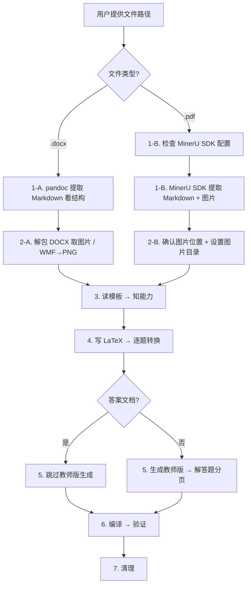

# 地理试卷 → LaTeX 自动排版

## 工作流概览



## 一句话原则

用户提供 **试卷文件路径**（DOCX 或 PDF）和 **模板路径** → 你全自动完成提取、转换、编译。用户不需要知道任何脚本路径。

## 输入格式自动识别

**根据文件扩展名自动选择提取流程：**
- **`.docx` 输入** → 使用 pandoc 提取文本 + 解包取图片
- **`.pdf` 输入** → 使用 MinerU SDK 提取 Markdown + 图片

## 关键约定：图片目录命名

**图片目录名自动推导规则**（用户可覆盖）：

**DOCX 输入时：**
- **答案文档**（文件名含"答案"）：取 DOCX 文件名去掉 `.docx`，加前缀 `Images-`
  - 如 `2025地理-答案.docx` → 图片目录 `Images-答案`
  - 如 `2026地理答案.docx` → 图片目录 `Images-2026地理答案`
- **试题文档**（不含"答案"）：固定为 `media`

**PDF 输入时：**
- MinerU SDK 会自动将图片保存到输出目录中（与 Markdown 同目录）
- 图片目录名取 PDF 文件名去掉 `.pdf`，加前缀 `Images-`
  - 如 `2025地理-答案.pdf` → 图片目录 `Images-2025地理-答案`
- 后续 LaTeX 中的 `\graphicspath` 应指向该目录

用户可显式指定目录名覆盖上述规则。

**在后续所有步骤中，用 `{图片目录}` 代表推导出的目录名。**

## 零配置检测

```bash
DOCX_SKILL_DIR=$(find ~/.claude/skills -maxdepth 2 -name "SKILL.md" -path "*/docx/SKILL.md" -exec dirname {} \; 2>/dev/null | head -1)
```

如果没找到，检查 `C:\Users\zhuge\.claude\skills\docx\` 是否存在。

## 标准工作流（按顺序执行）

### 1. 读取文件 → 看结构

**根据输入文件类型分支：**

#### 1-A. DOCX 输入（pandoc 方案）
```bash
pandoc "<docx路径>" -t markdown --wrap=none --track-changes=all
```
快速浏览输出，识别：标题、题型（选择题/非选择题/综合题）、题目编号、选项、图片标记（`` 或 `.wmf`）。

#### 1-B. PDF 输入（MinerU SDK 方案）

**⚠️ 先检查 MinerU SDK 配置：**

每次使用 PDF 输入前必须检查 `~/.mineru/config.yaml` 是否存在且包含有效的 `token`。

```python
import yaml
from pathlib import Path

config_path = Path.home() / ".mineru" / "config.yaml"
if config_path.exists():
    config = yaml.safe_load(config_path.read_text(encoding="utf-8"))
    token = config.get("token", "")
    if token:
        print("[OK] MinerU SDK token 有效 (len=%d)" % len(token))
    else:
        token = None
        print("[WARN] token 为空")
else:
    token = None
    print("[WARN] ~/.mineru/config.yaml 不存在")
```

**如果未配置：**

主动引导用户完成配置，**不要直接报错退出**。用友好语气告知：

> "使用 MinerU SDK 解析 PDF 需要配置 API Token。
>
> 请执行以下步骤：
>
> 1. 确保已安装 mineru-open-sdk：
>    ```bash
>    pip install mineru-open-sdk
>    ```
>
> 2. 创建配置文件：
>    ```bash
>    mkdir -p ~/.mineru
>    ```
>
> 3. 编辑 `~/.mineru/config.yaml`，写入：
>    ```yaml
>    token: '你的API密钥'
>    ```
>
> 4. 如果还没有密钥，请前往 https://mineru.net/apiManage/token 注册获取。
>
> 配置完成后重新运行即可。"

配置好后，继续执行转换。

**使用 MinerU SDK 提取 PDF：**

```bash
MATH_EXTRACT=$(find ~/.claude/skills -path "*/geo-paper-format*/scripts/math_pdf_extract.py" 2>/dev/null | head -1)
python "$MATH_EXTRACT" \
  "<pdf路径>" \
  --output-dir ./geo-output \
  --language ch
```

> **注意**：中文试卷使用 `--language ch`（已设为默认示例），英文论文用 `--language en`。

脚本会在 `./geo-output/` 目录生成：
- `<文件名>.md` — 最终的 Markdown 文件（核心产物）
- 图片文件自动保存在同目录或子目录中

**⚠️ Windows 编码兼容**：如遇 `UnicodeEncodeError: 'gbk'` 错误，加前缀：
```bash
PYTHONIOENCODING=utf-8 python "$MATH_EXTRACT" ...
```

**脚本参数说明：**

| 参数 | 默认值 | 说明 |
|------|--------|------|
| `--output-dir` | `./geo-output` | 输出目录 |
| `--model` | `vlm` | 模型版本：`pipeline` / `vlm` / `html` |
| `--ocr` | 关闭 | 对扫描件启用 OCR |
| `--language` | `en` | 文档语言（中文用 `ch`） |
| `--no-formula` | 开启公式识别 | 禁用公式识别 |
| `--no-table` | 开启表格识别 | 禁用表格识别 |
| `--pages` | 全部 | 页码范围，如 `"1-10,15"` |

**MinerU API 限制：**
- 单文件 ≤ 200MB，≤ 600 页
- 免费版 API 有调用频率限制，如遇限速请稍后重试
- 超出日限额（2000页）后解析优先级会降低，但仍可继续使用

### 2. 提取图片

**根据输入文件类型分支：**

#### 2-A. DOCX 输入（解包取图片）

**试题文档（无"答案"字样）：**
```bash
python "$DOCX_SKILL_DIR/scripts/office/unpack.py" "<docx路径>" "<临时目录>/"
cp "<临时目录>/word/media/"*.png "<docx所在目录>/"
```

**答案文档（文件名含"答案"）：**

首先推导图片目录名：DOCX 文件名去掉 `.docx`，前面加 `Images-`。
例如 `2025地理-答案.docx` → 图片目录 `Images-答案`。
用户可显式指定 `{图片目录}` 覆盖推导规则。

```bash
python "$DOCX_SKILL_DIR/scripts/office/unpack.py" "<docx路径>" "<临时目录>/"

# 推导图片目录名（Python 片段，执行时替换为实际目录）
import os
docx_basename = os.path.basename("<docx路径>")
img_dir = docx_basename.replace(".docx", "")
if not img_dir.startswith("Images-"):
    img_dir = "Images-" + img_dir
# 用户可在此覆盖 img_dir 变量

# 先复制原始 PNG（几何图/表格图）
mkdir -p "<docx所在目录>/$img_dir"
cp "<临时目录>/word/media/"*.png "<docx所在目录>/$img_dir/"

# 批量转换 WMF 公式图片为 PNG（600 DPI）
python3 << 'PYEOF'
import os, zipfile, glob
from PIL import Image

docx = glob.glob("*.docx")[0]
img_dir = "Images-" + os.path.basename(docx).replace(".docx", "")

# 从 DOCX 中提取 WMF
with zipfile.ZipFile(docx, 'r') as z:
    for name in z.namelist():
        if 'media' in name and name.lower().endswith('.wmf'):
            basename = os.path.basename(name)
            z.extract(name, "tmp_media")
            os.rename(f"tmp_media/{name}", f"{img_dir}/{basename}")
os.system("rm -rf tmp_media")

# 转换 WMF → PNG（600 DPI）
for fname in sorted(os.listdir(img_dir)):
    if not fname.lower().endswith('.wmf'):
        continue
    img = Image.open(f"{img_dir}/{fname}")
    w, h = img.size
    scale = 600 / 72.0
    new_w = max(int(w * scale), 30)
    new_h = max(int(h * scale), 30)
    img.resize((new_w, new_h), Image.LANCZOS).save(
        f"{img_dir}/{fname.replace('.wmf', '.png')}",
        dpi=(600, 600), quality=90)
    os.remove(f"{img_dir}/{fname}")
PYEOF
```

#### 2-B. PDF 输入（MinerU SDK 自动提取图片）

PDF 输入时，MinerU SDK 已在第 1-B 步已完成 Markdown + 图片的提取。图片已保存在输出目录中，**无需额外解包操作**。

只需确认图片位置并设置 `{图片目录}`：

```bash
# 检查 MinerU 输出目录中的图片
ls ./geo-output/  # 确认 <文件名>.md 和图片文件存在

# 如果图片在子目录中
ls ./geo-output/<文件名>/  # 检查子目录

# 设置图片目录变量
# 如果图片直接在 geo-output/ 下 → {图片目录} = geo-output
# 如果图片在 geo-output/<文件名>/ 下 → {图片目录} = geo-output/<文件名>
# 如果图片需要移到 docx 所在目录 → 执行移动：
cp -r ./geo-output/<图片子目录> "<docx所在目录>/{图片目录}/"
```

**PDF 输入的图片目录推导：**
- 取 PDF 文件名去掉 `.pdf`，加前缀 `Images-`
- 如 `2025地理-答案.pdf` → 图片目录 `Images-2025地理-答案`
- 如 `2026地理高考真题.pdf` → 图片目录 `Images-2026地理高考真题`

**后续步骤中 LaTeX 的 `\graphicspath` 应指向推导出的 `{图片目录}`。**

### 3. 读模板 → 知能力

**⚠️ 重要：两个内嵌模板已在本技能末尾的「嵌入式模板库」中：**
- **gaokao-geo-template.tex** — 地理试卷（学生版/教师版）排版模板
- **gaokao-geo-answer-template.tex** — 地理参考答案排版模板

**自动模板选择规则：**
- 当输入文件路径或文件名中含有 **"答案"** 字样时（如 `xxx-答案.docx` 或 `xxx-答案.pdf`），自动使用 **gaokao-geo-answer-template.tex**
- 当用户引用 gaokao-geo-template.tex 或未指定模板但明显是地理试卷时，自动使用 **gaokao-geo-template.tex**
- 当答案文件路径中不含"答案"但用户明确指定使用答案模板时，用 gaokao-geo-answer-template.tex

两个模板均无需读取外部文件，直接从下方嵌入式模板库中取用。

**答案文档的同目录试题检测：**
当处理答案文档（文件名含"答案"）时，**三段式匹配**检测同目录下对应的试题 `.tex` 文件：

**第一阶段 — 精确剥离：** 依次尝试从输入文件名移除以下模式后拼接 `.tex`：
- `-答案`（最常见，`2025地理-答案.docx` / `2025地理-答案.pdf` → `2025地理.tex`）
- `_答案`（`2025地理_答案.docx` → `2025地理.tex`）
- `答案`（无分隔符，`2025地理答案.docx` → `2025地理.tex`）
- `答案-` / `答案_`（答案在前，`答案-2025地理.docx` → `2025地理.tex`）

任一模式找到存在的文件即命中，**跳过后续阶段**。

**第二阶段 — 公共前缀匹配：** 精确剥离未命中时，扫描同目录下所有 `.tex` 文件（排除 `*教师版*`、`gaokao*`、`*template*`），对每个文件计算其文件名与答案文件名（已去除"答案"相关词和扩展名）的**最长公共前缀长度**，取前缀 ≥ 3 字符的最优匹配。

**第三阶段 — 回退：** 以上均失败时直接使用输入文件中的文本（现有行为不变）。

读取 `.tex` 模板（无论是外部文件还是内嵌模板），重点关注：
- 用了什么选择题环境（`tasks`? `choice`?）
- 大题用什么编号（`examenum`? 普通 `enumerate`?）
- 是否已加载 `graphicx`、`wrapfig`（图片嵌入用；没有则添加 `\usepackage{wrapfig}`）
- 自定义命令（`\blank`? `\mycircled`? `\Parallel`?）
- 当前是否有 `\linespread` 设置（影响页数控制）

### 4. 写 LaTeX → 逐题转换

保留模板的 **完整导言区**（`\documentclass{}` 到 `\begin{document}` 之间的所有内容），
只替换 `\begin{document}` 到 `\end{document}` 之间的正文。

**答案文档的题目提取（关键优化）：**
当处理答案文档时，使用三段式匹配查找对应的 `.tex` 试题文件，读取题目文本嵌入答案模板：

```python
import os, re

def find_matching_tex(input_path):
    """三段式匹配：找到答案文件对应的试题 .tex 文件路径，未找到返回 None。
    input_path 可以是 .docx 或 .pdf 文件。"""
    input_dir = os.path.dirname(input_path)
    input_stem = os.path.basename(input_path)
    for ext in ('.docx', '.pdf'):
        if input_stem.endswith(ext):
            input_stem = input_stem[:-len(ext)]
            break

    # ── 第一阶段：精确剥离答案后缀 ──
    patterns = [r'-答案$', r'_答案$', r'答案$', r'答案-', r'答案_']
    for pat in patterns:
        cand = re.sub(pat, '', input_stem)
        tex_path = os.path.join(input_dir, cand + '.tex')
        if os.path.exists(tex_path):
            print(f"第一阶段匹配: {tex_path}")
            return tex_path

    # ── 第二阶段：公共前缀匹配 ──
    clean_stem = re.sub(r'[-_ ]?答案[-_ ]?', '', input_stem)
    tex_files = [f for f in os.listdir(input_dir)
                 if f.endswith('.tex')
                 and '教师版' not in f
                 and not f.lower().startswith('gaokao')
                 and 'template' not in f.lower()]

    best, best_score = None, 0
    for tf in tex_files:
        stem = tf.replace('.tex', '')
        i = 0
        while i < min(len(clean_stem), len(stem)) and clean_stem[i] == stem[i]:
            i += 1
        if i > best_score:
            best_score, best = i, tf

    if best_score >= 3:
        tex_path = os.path.join(input_dir, best)
        print(f"第二阶段前缀匹配: {tex_path}")
        return tex_path

    # ── 第三阶段：回退 ──
    print("未找到对应试题 .tex 文件，将从输入文件提取题目文本")
    return None
```

这确保答案文档的题目描述与试题卷完全一致。

**PDF 输入时的转换注意：**

当输入为 PDF 时，MinerU SDK 已在第 1-B 步将内容提取为 Markdown。此时：
- **公式已为 LaTeX 格式**：MinerU 的公式识别功能默认开启，提取的 Markdown 中数学公式已为 `$...$` 或 `\[...\]` 格式，可直接引用或微调后嵌入 LaTeX
- **图片引用路径**：Markdown 中的图片路径 `` 需要对应到实际的 `{图片目录}` 位置
- **表格**：MinerU 提取的表格为 Markdown 格式，需手动转为 LaTeX `tabular` 环境
- **结构识别**：浏览 MinerU 生成的 Markdown，识别题型边界（一、二、三大题的标题行），然后按与 DOCX 相同的规则逐题转换为 LaTeX
- **MinerU 的 Markdown 输出需读取确认**：`cat ./geo-output/<文件名>.md` 或用 Read 工具查看完整内容

**地理学科公式与符号规则：**
- 行内 `$...$`，行间 `\[...\]`
- 温度：`$^\circ$C` 或 `℃`
- 经纬度：`$120^\circ$E`、`$30^\circ$N`
- 分数用 `\frac{}{}`
- 专有名词保留原文（如"秦岭-淮河线"、"喀斯特地貌"）

**题型编号约定（地理试卷）：**

| 题型 | 环境 |
|-----|------|
| 选择题 | `\begin{enumerate}[itemsep=0.3em]` |
| 多选题 | `\begin{enumerate}[start=N]` |
| 填空题/综合题 | `\begin{examenum}[start=N, itemsep=2.5cm]` |

选项 → tasks 环境（简短 4 列，内容长 2 列）；填空空位 → `\blank`；大题多问 → examenum 嵌套。

**图片插入规则（所有图片宽度不得超过 `0.35\textwidth`，图片显示在题目内容右侧）：**

- **小装饰图** → `\includegraphics[height=0.6em]{file.png}`（行内）

- **地图/示意图在列表环境外** → 用 `wrapfigure` 右侧环绕：
  ```latex
  \begin{wrapfigure}{r}{0.35\textwidth}
  \centering
  \includegraphics[width=\linewidth]{file.png}
  \end{wrapfigure}
  ```

- **地图/示意图在列表环境中**（如 `enumerate`、`examenum`）→ `wrapfigure` 会失效，改用 `minipage` 左右并排：
  ```latex
  \item （12分）如图，... 题目描述 ...

  \medskip
  \noindent
  \begin{minipage}[t]{0.62\textwidth}
  \begin{examenum}
      \item 第1问
      \item 第2问
  \end{examenum}
  \end{minipage}
  \hfill
  \begin{minipage}[t]{0.30\textwidth}
  \vspace{0pt}
  \centering
  \includegraphics[width=\linewidth]{file.png}
  \captionof{figure}{图注}
  \end{minipage}
  ```

- **TikZ 地图** → 用 `\resizebox{0.35\textwidth}{!}{...}` 控制宽度

**答案文档（文件名含"答案"）与试题文档的区别处理：**

当自动检测到答案文档（使用 gaokao-geo-answer-template.tex）时，按以下规则处理：

- **`\graphicspath` 对齐**：从答案模板中提取正文后，必须将 `\graphicspath{{images/}}` 替换为 `\graphicspath{{{图片目录}/}}`，其中 `{图片目录}` 为根据命名规则推导出的实际目录名
- **同目录试题检测**：自动查找同目录下同名 `.tex` 文件，若存在则读取该文件中的题目文本，用于补全答案模板中对应的题目描述
- **答案块结构**：保留完整结构 → 题目文本 → `\daan{...}`（答案）→ `\jieti`（解析）→ `\xijie`（详解）
- **解答题多问**：用 `\xiaoI` 和 `\xiaoII` 分别标记【小问 1 详解】和【小问 2 详解】
- **选项排版**：
  - **DOCX 输入**：答案文档的选项通常是图片（WMF公式），用 `\eqimg` 命令插入：`\eqimg[0.15]{imageN.png}`
  - **PDF 输入**：MinerU 提取的选项可能已有 LaTeX 公式，优先直接使用 LaTeX 格式；若为图片则同样用 `\eqimg` 插入
- **答案文档不需要生成教师版**，也**不需要 `itemsep` 间距**
- **表格**：用标准 `tabular` + `booktabs` 三线表，用 `\captionof{table}{...}` 加标题

**试题文档（使用 gaokao-geo-template.tex）继续沿用原有规则：**
- 选择题选项 → `tasks` 环境，大题 → `examenum` 环境
- 需要生成教师版（解答题每题分页）
- 图片使用 `wrapfigure` 或 `minipage` 环绕

**与模板一致性原则：**
- 标题格式完全沿用模板
- 注意事项文字直接复制模板
- 各题型标题直接复制模板
- 大题分值标注格式保持一致

**页数控制（重要）：**
学生版试卷通常会标注"本试卷共X页"，必须严格匹配。当添加 `itemsep=2.5cm` 等额外间距导致超页时：
- 在导言区添加 `\linespread{1.05}\selectfont` 轻微压缩行距
- 该压缩在视觉上几乎不可察觉，但能节省半页到一页空间
- 教师版不受试卷标注页数约束
- 教师版不需要 `itemsep=2.5cm`（因为分页已替代间隙作用），生成时移除该设置

### 5. 生成教师版 → 解答题每题分页

**注意：答案文档（文件名含"答案"）跳过此步，不需要生成教师版。**

试题文档的教师版生成规则：
- **前面选择题/填空题大题不分页**，连续排版
- **解答题（综合题）每题单独分页**（第一题跟在"综合题"标题后，后续各题各起新页）
- 受页数限制时，最后一题可不分页紧接前一题后

**⚠️ 重要：Python 字符串转义陷阱**

在 Python 中搜索 LaTeX 命令时，必须始终使用 **raw string**（`r"..."`），否则 `\b`、`\e` 等会被解析为转义字符：
- `"\\begin"` ❌ → 退格符 + `egin`（`\b` 是 backspace 0x08！）
- `r"\begin"` ✅ → 正确匹配 `\begin`
- `r"\item "` ✅ → 正确匹配 `\item `
- `r"\end{examenum}"` ✅ → 正确匹配 `\end{examenum}`

**教师版 Python 脚本模板：**

```python
# gen_teacher.py
with open("学生版.tex", "r", encoding="utf-8") as f:
    content = f.read()

start_marker = r"\begin{examenum}[start=N, itemsep=2.5cm]"
end_marker = r"\end{examenum}"

start_idx = content.find(start_marker)
end_idx = content.rfind(end_marker)

exam_block = content[start_idx:end_idx + len(end_marker)]
lines = exam_block.split('\n')
depth = 0
item_count = 0
new_lines = []

for line in lines:
    if r"\begin{examenum}" in line and r"[start=N, itemsep=2.5cm]" not in line:
        depth += 1
    elif r"\end{examenum}" in line:
        if depth > 0:
            depth -= 1

    stripped = line.lstrip()
    if stripped.startswith(r"\item ") and depth == 0:
        item_count += 1
        if item_count >= 2:
            new_lines.append(r"\newpage")

    new_lines.append(line)

modified_block = '\n'.join(new_lines)

# 教师版去掉 itemsep（分页替代了间隙）
modified_block = modified_block.replace(
    "[start=N, itemsep=2.5cm]", "[start=N]"
)

new_content = content[:start_idx] + modified_block + \
              content[end_idx + len(end_marker):]

with open("教师版.tex", "w", encoding="utf-8") as f:
    f.write(new_content)
```

### 6. 编译 → 验证

**试题文档 → 编译两个版本（各两次）：**
```bash
cd "<docx所在目录>"

# 学生版
xelatex -interaction=nonstopmode "<输出文件名>.tex"
xelatex -interaction=nonstopmode "<输出文件名>.tex"
grep -E "Overfull|Error" "<输出文件名>.log" | grep -v "infwarerr"

# 教师版
xelatex -interaction=nonstopmode "<输出文件名>-教师版.tex"
xelatex -interaction=nonstopmode "<输出文件名>-教师版.tex"
grep -E "Overfull|Error" "<输出文件名>-教师版.log" | grep -v "infwarerr"

# 确认页数
pdfinfo "<输出文件名>.pdf" 2>/dev/null | grep Pages
pdfinfo "<输出文件名>-教师版.pdf" 2>/dev/null | grep Pages
```

**答案文档 → 只编译一个版本：**
```bash
cd "<docx所在目录>"
xelatex -interaction=nonstopmode "<输出文件名>.tex"
xelatex -interaction=nonstopmode "<输出文件名>.tex"
grep -E "Overfull|Error" "<输出文件名>.log" | grep -v "infwarerr"
pdfinfo "<输出文件名>.pdf" 2>/dev/null | grep Pages
```

**验证要点：**
- 学生版/答案版页数应与试卷标注一致（如"本试卷共X页"）
- 教师版页数合理
- 解答题编号正确
- 答案文档的【答案】【解析】【详解】结构显示正确
- 图片显示正常

### 7. 清理
```bash
rm -rf "<临时目录>"
rm -f gen_teacher.py
rm -f "<输出文件名>.aux" "<输出文件名>.log" "<输出文件名>.out"
rm -f "<输出文件名>-教师版.aux" "<输出文件名>-教师版.log" "<输出文件名>-教师版.out"
```

保留：
- **试题文档**：两个 `.tex` 源文件（学生版+教师版）、两个 `.pdf`、必要的 `.png` 图片
- **答案文档**：一个 `.tex` 源文件、一个 `.pdf`、`{图片目录}/` 目录（含公式 PNG 图片）

## 常见问题快速修复

| 症状 | 原因 | 修复 |
|------|------|------|
| `Overfull \hbox` | 公式或选项超宽 | 选项改 2 列；`\dfrac` 改 `\frac`；缩短公式 |
| `Undefined control sequence` | 缺少宏包 | 在导言区添加 `\usepackage{...}` |
| 图片错位/消失 | 列表环境中用了 `wrapfigure` | 改用 `minipage` 左右并排 |
| 页数超限 | 添加了 2.5cm 间隙 | 加 `\linespread{1.05}\selectfont` 压缩行距 |
| Python 匹配不到 LaTeX 命令 | 字符串转义问题 | 必须用 raw string `r"\begin"` 而非 `"\\begin"` |
| 教师版分页没生效 | Python 字符串中 `\b` 被当作退格符 | 所有含 `\b` 的字符串前加 `r` 前缀 |
| 中文不显示 | 非 ctex 模板 | 确认模板用 `ctexart` 或添加 `\usepackage{ctex}` |
| 编译有 Missing $ | 花括号不匹配或中文在公式外 | 检查 `$...$` 配对 |
| 答案文档中 WMF 图片过多（DOCX 输入） | 未批量转换 | 用 Python+Pillow 批量渲染 WMF→PNG，600 DPI，保存在 `{图片目录}/` |
| 答案文档中图片不显示 | `\graphicspath` 与图片目录不匹配 | 确认 LaTeX 输出中 `\graphicspath{{目录/}}` 与实际图片目录名一致 |
| MinerU SDK 解析失败（PDF 输入） | Token 无效/网络问题/文件过大 | 检查 `~/.mineru/config.yaml`；文件 ≤ 200MB/600 页；扫描件加 `--ocr` |
| MinerU 输出公式乱码（PDF 输入） | 公式识别质量不佳 | 尝试 `--model vlm`（默认）；扫描件加 `--ocr`；对个别公式手动修正 |
| PDF 提取后图片路径不对 | MinerU 图片目录与 LaTeX `\graphicspath` 不匹配 | 确认 `{图片目录}` 推导正确，`\graphicspath` 指向实际图片位置 |
| `UnicodeEncodeError: 'gbk'`（Windows） | Windows 终端编码为 GBK | 加 `PYTHONIOENCODING=utf-8` 前缀执行脚本 |

## 用户调用示例

用户只需要说：
> 帮我把 `2025年高考地理真题.docx` 排版成 LaTeX

或者：
> 排版这个地理试卷

**PDF 输入示例：**
> 帮我把 `2025年高考地理真题.pdf` 排版成 LaTeX

**答案文档自动识别：**
如果输入文件名包含"答案"（如 `2025地理-答案.docx` 或 `2025地理-答案.pdf`），技能会自动选用答案模板（gaokao-geo-answer-template.tex），无需手动指定。处理规则也自动切换为答案排版模式（保留【答案】【解析】【详解】结构，不生成教师版）。

**DOCX 输入时**：图片目录自动命名为 `Images-` + 文档名，WMF→PNG批量转换，且 `\graphicspath` 自动对齐。

**PDF 输入时**：使用 MinerU SDK 自动提取 Markdown + 图片，图片目录自动命名为 `Images-` + PDF文件名，公式已为 LaTeX 格式可直接引用。

如果你能获取到文件路径就直接执行，否则问用户文件在哪里。

---

## 嵌入式模板库

### gaokao-geo-template.tex（地理试卷排版模板）

当用户需要使用地理试卷排版时，以此模板为默认模板。完整内容如下：

```latex
% ============================================================
%  地理试卷 LaTeX 模板
%  适用于高考地理/文科综合地理部分试卷排版
%  说明：
%    - 采用 12pt 字号 + 2.5cm 边距
%    - 选择题选项使用 tasks 环境
%    - 大题编号使用 enumitem 体系，支持多级嵌套
%    - 支持图片 wrapfigure/minipage 环绕
%    - 支持 TikZ 绘图（区域地图示意）
% ============================================================

\documentclass[12pt, a4paper, oneside]{ctexart}

% ── 1. 数学与链接 ──
\usepackage{amsmath, amsthm, amssymb}
\usepackage[bookmarks=true, colorlinks, citecolor=blue, linkcolor=black]{hyperref}

% ── 2. 字体方案 ──
\usepackage{newtxmath}

% ── 3. 页面布局（2.5cm 边距） ──
\usepackage[a4paper, margin=2.5cm, footskip=1cm]{geometry}

% ── 4. 页眉页脚 ──
\usepackage{fancyhdr}
\usepackage{lastpage}
\pagestyle{fancy}
\fancyhf{}
\fancyfoot[C]{地理试题第\thepage 页（共\pageref{LastPage}页）}
\renewcommand{\headrulewidth}{0pt}
\renewcommand{\footrulewidth}{0pt}

% ── 5. 表格与插图 ──
\usepackage{graphicx}
\usepackage{adjustbox}
\usepackage{diagbox}
\usepackage{makecell}
\usepackage{caption}
\usepackage{float}
\usepackage{tikz}
\usetikzlibrary{arrows.meta, positioning, shapes.geometric}

% ── 6. 选择题选项（tasks 环境） ──
\usepackage{tasks}
\settasks{
    label       = \Alph*.,
    label-width = 1.8em,
    item-indent = 2.4em,
    label-offset = 0.5em,
    column-sep  = 2em,
    before-skip = 0pt,
    after-skip  = 0pt
}

% ── 7. 大题编号（enumitem 体系，支持三级嵌套） ──
\usepackage[shortlabels]{enumitem}
\newlist{examenum}{enumerate}{3}
\setlist[examenum,1]{label=\arabic*., leftmargin=2em, itemsep=0.3em, parsep=0em}
\setlist[examenum,2]{label=(\arabic*), leftmargin=1.5em, itemsep=0.1em, parsep=0em}
\setlist[examenum,3]{label=(\roman*), leftmargin=1.5em, itemsep=0.1em, parsep=0em}

% ── 8. 自定义命令 ──

% 下划线填空（用于填空题）
\newcommand{\blank}{\underline{\hspace{2cm}}}

% 大标题辅助命令
\newcommand{\subjecttitle}[1]{{\fontsize{24pt}{22pt}\selectfont\centering\textbf{#1}\par}}
\newcommand{\subtitle}[1]{{\fontsize{16pt}{16pt}\selectfont\centering #1\par}}

% 图片插入命令（地理图表）
\newcommand{\geoimg}[2][0.35]{%
  \includegraphics[width=#1\textwidth,keepaspectratio]{#2}%
}

% ── 9. 正文开始 ──
\begin{document}

% ── 试卷标题区 ──
\begin{center}
    \LARGE{\textbf{202X年普通高等学校招生全国统一考试\\地理}}
\end{center}

\vspace{0.5em}

% ── 注意事项 ──
\noindent\textbf{注意事项}：

1．答卷前，考生务必将自己的姓名、准考证号填写在答题卡上。

2．回答选择题时，选出每小题答案后，用铅笔把答题卡上对应题目的答案标号涂黑。
如需改动，用橡皮擦干净后，再选涂其它答案标号。回答非选择题时，将答案写在答题卡上，
写在本试卷上无效。

3．考试结束后，将本试卷和答题卡一并交回。

\vspace{1em}

% ══════════════════════════════════════════
%  一、选择题（15 小题，每小题 3 分，共 45 分）
% ══════════════════════════════════════════

\noindent\textbf{一、选择题：本题共15小题，每小题3分，共45分。在每小题给出的四个选项中，
只有一项是符合题目要求的。}

\begin{enumerate}[itemsep=0.3em]
    \item 下图为某区域等高线地形图。据此回答1～2题。

    \begin{wrapfigure}{r}{0.35\textwidth}
    \centering
    \includegraphics[width=\linewidth]{media/img_001.png}
    \captionof{figure}{某区域等高线地形图}
    \end{wrapfigure}

    \item 图中①②③④四地中，海拔最高的是
    \begin{tasks}(4)
        \task ①
        \task ②
        \task ③
        \task ④
    \end{tasks}

    \item 图中河流流向为
    \begin{tasks}(4)
        \task 自东向西
        \task 自西向东
        \task 自南向北
        \task 自北向南
    \end{tasks}
\end{enumerate}

% ══════════════════════════════════════════
%  二、非选择题（共 55 分）
% ══════════════════════════════════════════

\noindent\textbf{二、非选择题：共55分。第16～18题为必考题，每个试题考生都必须作答。}

\begin{examenum}[start=16, itemsep=2.5cm]
    \item （12分）阅读图文材料，完成下列要求。

    \begin{wrapfigure}{r}{0.35\textwidth}
    \centering
    \includegraphics[width=\linewidth]{media/img_002.png}
    \captionof{figure}{某区域地理事物分布图}
    \end{wrapfigure}

    材料一：某区域位于北纬30°～40°之间，地势西高东低，气候多样。

    \begin{examenum}
        \item 简述该区域地形特征。（4分）
        \item 分析该区域气候类型及成因。（4分）
        \item 说明该区域主要生态环境问题及治理措施。（4分）
    \end{examenum}

    \item （15分）阅读图文材料，完成下列要求。

    材料二：下表为甲、乙、丙三地气候数据统计表。

    \begin{table}[H]
    \centering
    \begin{tabular}{|c|c|c|c|}
    \hline
    地点 & 年均温(℃) & 年降水量(mm) & 气候类型 \\
    \hline
    甲 & 15.2 & 850 & 亚热带季风气候 \\
    \hline
    乙 & 8.6 & 420 & 温带大陆性气候 \\
    \hline
    丙 & 22.1 & 1560 & 热带季风气候 \\
    \hline
    \end{tabular}
    \end{table}

    \begin{examenum}
        \item 判断甲、乙、丙三地所属的气候类型。（3分）
        \item 分析三地气候差异的主要成因。（6分）
        \item 说明气候对三地农业生产的影响。（6分）
    \end{examenum}
\end{examenum}

\end{document}
```

### gaokao-geo-answer-template.tex（地理参考答案模板）

当输入文件路径中含"答案"字样时（DOCX 或 PDF），自动使用此模板。完整内容如下：

```latex
% ============================================
% 地理参考答案 LaTeX 模板
%  适用于高考地理试卷的答案解析排版
% 使用 XeLaTeX 编译
% ============================================
\documentclass[12pt,a4paper]{ctexart}

% ========== 页面布局 ==========
\usepackage[top=2cm,bottom=2cm,left=2.5cm,right=2.5cm]{geometry}
\usepackage{setspace}
\onehalfspacing

% ========== 列表 ==========
\usepackage{enumitem}

% ========== 数学公式 ==========
\usepackage{amsmath,amssymb}
\usepackage{bm}

% ========== 插图 ==========
\usepackage{graphicx}
\graphicspath{{images/}}

% ========== 颜色 ==========
\usepackage{xcolor}

% ========== 表格 ==========
\usepackage{array,booktabs,caption}

% ========== 页眉页脚 ==========
\usepackage{fancyhdr}
\setlength{\headheight}{13.6pt}
\pagestyle{fancy}
\fancyhf{}
\fancyhead[C]{\small 202X年普通高等学校招生全国统一考试\,$\cdot$\,地理\quad 参考答案}
\fancyfoot[C]{\thepage}
\renewcommand{\headrulewidth}{0.4pt}

% ========== 超链接 ==========
\usepackage[hidelinks]{hyperref}

% ========== 自定义命令 ==========

% 【答案】红色加粗
\newcommand{\daan}[1]{{\color{red}\textbf{【答案】#1}}}

% 【解析】灰色前缀，正文用楷体
\newcommand{\jieti}{\par{\color{gray!60!black}\textbf{【解析】}}}

% 【详解】蓝色前缀
\newcommand{\xijie}{\par{\color{blue!60!black}\textbf{【详解】}}}

% 【小问1详解】、【小问2详解】
\newcommand{\xiaoI}{\par{\color{blue!60!black}\textbf{【小问 1 详解】}}}
\newcommand{\xiaoII}{\par{\color{blue!60!black}\textbf{【小问 2 详解】}}}

% 插入公式图片（WMF 转为 PNG）
\newcommand{\eqimg}[2][0.5]{%
  \includegraphics[width=#1\textwidth,keepaspectratio]{#2}%
}

% 虚数单位和自然底数
\newcommand{\mi}{\mathrm{i}}
\newcommand{\me}{\mathrm{e}}

% ========== 正文 ==========
\begin{document}

% 标题区
\begin{center}
    {\large\textbf{绝密\,$\bigstar$\,启用前\qquad 试卷类型：A}}
    \vspace{1em}
    {\Large\textbf{202X年普通高等学校招生全国统一考试}}
    \vspace{0.5em}
    {\huge\textbf{地\ \ 理}}
    \vspace{1em}
    {\large\textbf{参考答案}}
    \vspace{0.5em}
    \hrule
\end{center}

% ══════════════════════════════════════
%  一、选择题（15 小题，共 45 分）
% ══════════════════════════════════════
\section*{一、选择题}
本题共 15 小题，每小题 3 分，共 45 分。在每小题给出的四个选项中，
只有一项是符合题目要求的。

\begin{enumerate}
    \item 题目文本
    \begin{flushleft}
        A.\ \eqimg[0.15]{imageN.png}\quad
        B.\ \eqimg[0.15]{imageN.png}\quad
        C.\ \eqimg[0.15]{imageN.png}\quad
        D.\ \eqimg[0.15]{imageN.png}
    \end{flushleft}
    \daan{B}
    \jieti 解析内容.
    \xijie 详解内容.
\end{enumerate}

% ══════════════════════════════════════
%  二、非选择题（共 55 分）
% ══════════════════════════════════════
\section*{二、非选择题}
共 55 分。第 16～18 题为必考题，每个试题考生都必须作答。

\begin{enumerate}[resume]
    \item （12分）题目描述．
    \begin{enumerate}
        \item 第1问；
        \item 第2问．
    \end{enumerate}
    \daan{(1) 答案\quad (2) 答案}
    \jieti 解析内容.
    \xiaoI 第1问详解.
    \xiaoII 第2问详解.
\end{enumerate}

\end{document}
```

---

## 快速启动

```
请按 geo-paper-format 执行流水线：
输入文件: <原始 docx/pdf 绝对路径>
```

执行后将自动：
1. 确认输入文件存在
2. 识别文件类型（DOCX/PDF）
3. 选择对应提取流程（pandoc / MinerU SDK）
4. 逐步骤调度执行
5. 每步完成后报告状态
6. 编译生成 PDF
7. 全部完成后输出汇总报告
