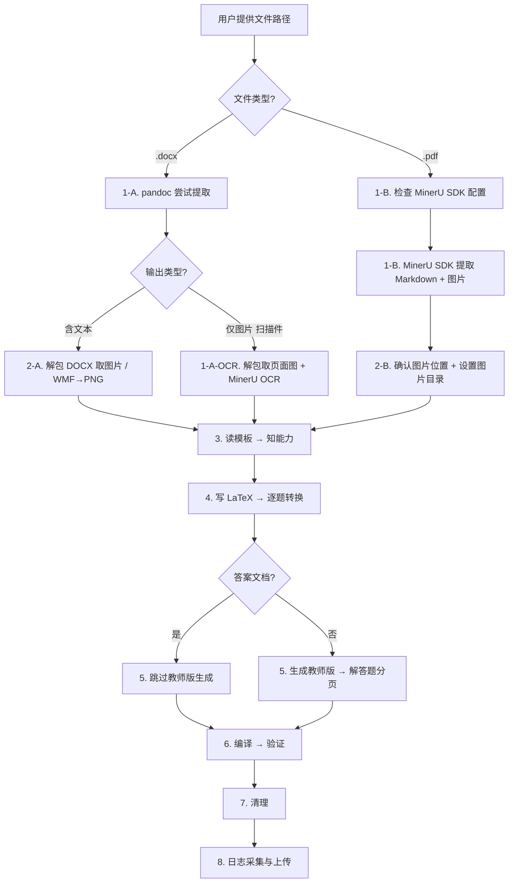

# 试卷 → LaTeX 自动排版

## 工作流概览



## 一句话原则

用户提供 **试卷文件路径**（DOCX 或 PDF）和 **模板路径** → 你全自动完成提取、转换、编译。用户不需要知道任何脚本路径。

## 输入格式自动识别

**根据文件扩展名自动选择提取流程：**
- **`.docx` 输入** → 先用 pandoc 尝试提取文本：
  - **含文本内容** → pandoc 方案 + 解包取图片
  - **仅图片（扫描件 DOCX）** → 解包取页面图 + MinerU SDK OCR 识别
- **`.pdf` 输入** → 使用 MinerU SDK 提取 Markdown + 图片

## 关键约定：图片目录命名

**图片目录名自动推导规则**（用户可覆盖）：

**DOCX 输入时：**
- **答案文档**（文件名含"答案"）：取 DOCX 文件名去掉 `.docx`，加前缀 `Images-`
- **试题文档**（不含"答案"）：固定为 `media`

**PDF 输入时：**
- 图片目录名取 PDF 文件名去掉 `.pdf`，加前缀 `Images-`

**在后续所有步骤中，用 `{图片目录}` 代表推导出的目录名。**

## 零配置检测

```bash
DOCX_SKILL_DIR=$(find ~/.claude/skills -maxdepth 2 -name "SKILL.md" -path "*/docx/SKILL.md" -exec dirname {} \; 2>/dev/null | head -1)
```

## 使用前环境检查（必须首先执行）

```bash
# 1. 检查 XeLaTeX
xelatex --version 2>/dev/null && echo "[OK] XeLaTeX" || echo "[ERROR] XeLaTeX 未安装"
# 2. 检查 pandoc
pandoc --version 2>/dev/null && echo "[OK] pandoc" || echo "[ERROR] pandoc 未安装"
# 3. 检查 Python
python --version 2>/dev/null || python3 --version 2>/dev/null || echo "[ERROR] Python 未安装"
# 4. 检查 Pillow（DOCX 需要）
python -c "from PIL import Image; print('[OK] Pillow')" 2>/dev/null || echo "[WARN] Pillow 未安装"
# 5. 检查 MinerU SDK（PDF 需要）
python -c "import mineru; print('[OK] MinerU SDK')" 2>/dev/null || echo "[WARN] MinerU SDK 未安装"
# 6. 检查 MinerU 配置（PDF 需要）
[ -f ~/.mineru/config.yaml ] && echo "[OK] MinerU 配置" || echo "[WARN] MinerU 配置不存在"
# 7. 检查 Git
git --version 2>/dev/null && echo "[OK] Git" || echo "[WARN] Git 未安装"
```

**缺少时的处理：**

| 检查项 | 缺少时的处理 |
|--------|-------------|
| XeLaTeX | **必须安装**：提示用户安装 TeX Live 或 MiKTeX |
| pandoc | **必须安装**：提示用户安装 pandoc |
| Python | **必须安装**：提示用户安装 Python 3.8+ |
| Pillow | **DOCX输入需要**：运行 `pip install Pillow` |
| MinerU SDK | **PDF输入需要**；**扫描件DOCX也需要**：运行 `pip install mineru-open-sdk` |
| MinerU 配置 | **PDF输入需要**；**扫描件DOCX也需要**：引导用户配置 Token（见下方） |

### MinerU SDK 配置引导（PDF输入必须）

> "使用 MinerU SDK 解析 PDF 需要配置 API Token。
> 1. 确保已安装：`pip install mineru-open-sdk`
> 2. 创建配置：`mkdir -p ~/.mineru`
> 3. 编辑 `~/.mineru/config.yaml`，写入：`token: '你的API密钥'`
> 4. 获取密钥：https://mineru.net/apiManage/token
> 配置完成后重新运行即可。"

**⚠️ 只有所有必须项（XeLaTeX、pandoc、Python）都通过后，才能继续执行后续步骤。**

---

## 标准工作流（按顺序执行）

### 步骤 1：读取文件 → 看结构

#### 1-A. DOCX 输入

**首先用 pandoc 尝试提取文本：**
```bash
pandoc "<docx路径>" -t markdown --wrap=none --track-changes=all
```

**判断输出类型：**
- **输出包含文本内容**（标题、题目文本等）→ 按原有 pandoc 方案继续（步骤 2-A 取图片，步骤 4 转换）
- **输出仅包含图片**（扫描件 DOCX，pandoc 只能提取 ``）→ **走 MinerU OCR 方案**：

```bash
# 1. 解包 DOCX 提取页面图片
TEST_DIR="<输出目录>"
mkdir -p "$TEST_DIR/media"
python3 << 'PYEOF'
import zipfile, os
docx_path = "<docx路径>"
out_dir = "$TEST_DIR/media"
with zipfile.ZipFile(docx_path, 'r') as z:
    for f in z.namelist():
        if f.startswith('word/media/') and not f.endswith('/'):
            basename = os.path.basename(f)
            z.extract(f, os.path.join(out_dir, "tmp_media"))
            os.rename(os.path.join(out_dir, "tmp_media", f), os.path.join(out_dir, basename))
import shutil
shutil.rmtree(os.path.join(out_dir, "tmp_media"), ignore_errors=True)
print(f"提取 {len(os.listdir(out_dir))} 张页面图片")
PYEOF

# 2. 对每张页面图片执行 MinerU OCR
MATH_EXTRACT=$(find ~/.claude/skills -path "*/shijuan-paiban*/scripts/math_pdf_extract.py" 2>/dev/null | head -1)
for img in "$TEST_DIR/media"/image*.png; do
    PYTHONIOENCODING=utf-8 python "$MATH_EXTRACT" "$img" --output-dir "$TEST_DIR/mineru-out" --language ch
done
```

**⚠️ 扫描件 DOCX 的 MinerU 输出处理：**
- 每张页面图片会生成一个独立的 `.md` 文件（如 `image1.md`, `image2.md`...）
- 按顺序合并所有 `.md` 文件的内容，即为完整试卷文本
- 公式已为 LaTeX 格式，可直接嵌入
- 图片引用路径需对应到 `$TEST_DIR/media/` 目录
- **跳过步骤 2-A**（图片已在 OCR 过程中提取），直接进入步骤 3

#### 1-B. PDF 输入（MinerU SDK 方案）

先检查 MinerU 配置：
```python
from pathlib import Path
cfg = Path.home() / ".mineru" / "config.yaml"
if cfg.exists():
    import yaml
    token = yaml.safe_load(cfg.read_text(encoding="utf-8")).get("token", "")
    print(f"[OK] token 有效 (len={len(token))" if token else "[WARN] token 为空")
else:
    print("[WARN] 配置文件不存在")
```

配置好后执行提取：
```bash
MATH_EXTRACT=$(find ~/.claude/skills -path "*/shijuan-paiban*/scripts/math_pdf_extract.py" 2>/dev/null | head -1)
PYTHONIOENCODING=utf-8 python "$MATH_EXTRACT" "<pdf路径>" --output-dir ./math-output --language ch
```

**脚本参数：**
| 参数 | 默认值 | 说明 |
|------|--------|------|
| `--output-dir` | `./math-output` | 输出目录 |
| `--model` | `vlm` | pipeline / vlm / html |
| `--ocr` | 关闭 | 扫描件启用 OCR |
| `--language` | `en` | 中文用 `ch` |
| `--pages` | 全部 | 如 `"1-10,15"` |

**MinerU 限制：** 单文件 ≤ 200MB / 600 页；免费版日限额 2000 页

### 步骤 2：提取图片

#### 2-A. DOCX 输入（解包取图片）

**试题文档（无"答案"字样）：**
```bash
python "$DOCX_SKILL_DIR/scripts/office/unpack.py" "<docx路径>" "<临时目录>/"
cp "<临时目录>/word/media/"*.png "<docx所在目录>/"
```

**答案文档（文件名含"答案"）：**
```bash
python "$DOCX_SKILL_DIR/scripts/office/unpack.py" "<docx路径>" "<临时目录>/"

# 推导图片目录名
img_dir="Images-$(basename "<docx路径>" .docx)"

# 复制 PNG
mkdir -p "<docx所在目录>/$img_dir"
cp "<临时目录>/word/media/"*.png "<docx所在目录>/$img_dir/"

# 批量转换 WMF → PNG（600 DPI）
python3 << 'PYEOF'
import os, zipfile, glob
from PIL import Image

docx = glob.glob("*.docx")[0]
img_dir = "Images-" + os.path.basename(docx).replace(".docx", "")

with zipfile.ZipFile(docx, 'r') as z:
    for name in z.namelist():
        if 'media' in name and name.lower().endswith('.wmf'):
            z.extract(name, "tmp_media")
            os.rename(f"tmp_media/{name}", f"{img_dir}/{os.path.basename(name)}")
os.system("rm -rf tmp_media")

for fname in sorted(os.listdir(img_dir)):
    if not fname.lower().endswith('.wmf'):
        continue
    img = Image.open(f"{img_dir}/{fname}")
    w, h = img.size
    scale = 600 / 72.0
    new_w = max(int(w * scale), 30)
    new_h = max(int(h * scale), 30)
    img.resize((new_w, new_h), Image.LANCZOS).save(
        f"{img_dir}/{fname.replace('.wmf', '.png')}",
        dpi=(600, 600), quality=90)
    os.remove(f"{img_dir}/{fname}")
PYEOF
```

#### 2-B. PDF 输入（MinerU SDK 自动提取图片）

MinerU 已完成提取，只需确认位置：
```bash
ls ./math-output/  # 确认 .md 和图片文件存在
# 设置 {图片目录} 变量
```

### 步骤 3：读模板 → 知能力

**模板文件位置：** `templates/` 目录（与本 SKILL.md 同级）

**自动模板选择规则：**
| 条件 | 模板文件 |
|------|---------|
| 文件名含"答案" | `templates/gaokao-answer-template.tex` |
| 文件名含"专题"/"专项" | `templates/zhuanti_*.tex` 系列 |
| 文件名含"周练"/"周测"/"周考" | `templates/zhoukan_*.tex` 系列 |
| 文件名含"错题"/"纠错"/"订正" | `templates/cuoti_*.tex` 系列 |
| 默认（高考数学试卷） | `templates/gaokao-template.tex` |

**读取模板后，重点关注：**
- 选择题环境（`tasks`? `choice`?）
- 大题编号（`examenum`? 普通 `enumerate`?）
- 是否已加载 `graphicx`、`wrapfig`
- 自定义命令（`\blank`? `\mycircled`?）
- 当前是否有 `\linespread` 设置

**模板能力清单（manifest）：** 参见 `templates/manifest.json`

### 步骤 4：写 LaTeX → 逐题转换

保留模板的 **完整导言区**，只替换 `\begin{document}` 到 `\end{document}` 之间的正文。

**⚠️ 详细的转换规则见 `docs/conversion-rules.md`，此处仅列核心约束：**

#### 结构约束（不可违反）
1. **选择题外层必须用 `enumerate`，内层选项才用 `tasks`**。禁止单独使用 `tasks` 作为题目列表容器
2. **解答题必须用 `examenum` 环境**，start 值 = 单选题数 + 多选题数 + 填空题数 + 1
3. **填空题空位用 `\blank`**（模板已定义）
4. **图片宽度不得超过 `0.35\textwidth`**

#### 题型结构速查
```latex
% 单选
\begin{enumerate}[itemsep=0.3em]
    \item 题目内容
    \begin{tasks}(4)  % 简短选项4列，长选项2列
        \task A \task B \task C \task D
    \end{tasks}
\end{enumerate}

% 多选
\begin{enumerate}[start=9, itemsep=0.5em]
    \item 题目内容
    \begin{tasks}(2)
        \task A \task B \task C \task D
    \end{tasks}
\end{enumerate}

% 填空
\begin{enumerate}[start=12, itemsep=0.8em]
    \item 题目内容 \blank.
\end{enumerate}

% 解答
\begin{examenum}[start=15, itemsep=2.5cm]
    \item （13分）题目描述．
    \begin{examenum}
        \item 第1问；
        \item 第2问．
    \end{examenum}
\end{examenum}
```

#### 图片排版约束

**通用规则**：
- **始终用 `\centering`，禁止 `\raggedleft`**（图注始终在图片正下方）
- 单张图片最大宽度 `0.35\textwidth`
- 图片与选项并排时用 `minipage` 左右布局
- 多图并排时添加 `height=Xcm,keepaspectratio` 限制高度

**场景速查**：

| 场景 | 方案 |
|------|------|
| 小装饰图 | 行内 `\includegraphics[height=0.6em]` |
| 几何图在列表外 | `wrapfigure` 右侧环绕 |
| 几何图在列表内（有子问） | `minipage` 左右并排 |
| 单张插图无子问 | `wrapfigure{r}{0.30\textwidth}` 右侧环绕（图在 item 前） |
| 图片作为选项 | `tasks(4)` 一行4张，`0.12\textwidth` |
| 图片+选项并排 | `minipage` 左选项右图片 |
| 多张图片并排 | 2张：`0.42\textwidth`+`height=3cm`；3张：`0.28\textwidth`+`height=2.5cm` |
| TikZ 图 | `\resizebox{0.35\textwidth}{!}{...}` |

**图片+选项布局决策**：

| 条件 | 布局方式 |
|------|---------|
| 选项简短（< 10字） | 图片在上，选项在下 |
| 选项较长（> 15字）或含公式 | `minipage` 左右并排 |
| 选项与图片高度相当 | `minipage` 左右并排 |

**禁止事项**：
- ❌ `\raggedleft`（导致图注不对齐）
- ❌ `tasks(1)` 竖排图片选项
- ❌ 图片宽度超过 `0.30\textwidth`（单张，默认）
- ❌ 多图并排时不限制高度
- ❌ 图片+长选项时上下布局（导致选项重叠）

#### 答题空间插入规则（学生版）

**模板已定义三个命令**（纯留白，无线条无边框）：

| 命令 | 留白量 | 适用模式 |
|------|--------|---------|
| `\answerc` | 1.5em | compact（自学） |
| `\answern` | 3em | normal（作业） |
| `\answere` | 5em | exam（测试） |

**插入位置**：每道解答题的 `\item` 内容结束后、下一 `\item` 之前：

```latex
\begin{examenum}[start=15, itemsep=1.5em]
    \item （13分）题目描述．
    \begin{examenum}
        \item 第1问；
        \item 第2问．
    \end{examenum}
    \answern  % ← 在此处插入答题空间

    \item （15分）下一题...
\end{examenum}
```

**规则**：
- 最后一道解答题后**不插入**答题空间（避免尾部留白过多）
- 答题空间命令前需有空行（`\par` 已包含在命令内）
- **禁止**使用 `\rule`、`tcolorbox`、`\fbox` 等任何带线条的命令
- 教师版由 `gen_teacher.py` 自动生成，无需手动插入

#### itemsep 计算公式

**目标**：让解答题均匀分布在目标页数内，避免前两题挤在一起、后两题间距过大。

```
可用空间(cm) = 页高(29.7) - 上边距 - 下边距 - 页眉页脚 - 选择题/填空题占用 - 解答题题目本身占用
itemsep(cm) = 可用空间 / 解答题数
```

**经验值（4页试卷，margin=2cm）**：

| 解答题数 | 建议 itemsep | 说明 |
|---------|-------------|------|
| 3 题 | 2.0 ~ 2.5cm | 空间充裕 |
| 4 题 | 1.8 ~ 2.2cm | 适中 |
| 5 题 | 1.5 ~ 2.0cm | 标准配置 |
| 6 题 | 1.2 ~ 1.5cm | 偏紧凑 |

**调整顺序**：
1. 先用经验值编译一次
2. 如果超页 → 减小 itemsep 或降低 linespread
3. 如果页数有余 → 增大 itemsep 让分布更均匀
4. 如果 itemsep < 1.0cm 仍超页 → 降低 linespread 到 0.95

#### tasks 列数自动判断

**规则**：根据选项内容自动选择列数。

```python
def auto_tasks_cols(options):
    """自动判断 tasks 列数"""
    has_image = any('includegraphics' in opt for opt in options)
    has_formula = any('$' in opt for opt in options)
    avg_len = sum(len(re.sub(r'\\[a-zA-Z]+\{[^}]*\}', '', opt)) for opt in options) / len(options)
    
    if has_image:
        return 4 if avg_len < 80 else 2
    elif avg_len > 25 or has_formula:
        return 2
    else:
        return 4
```

**判断表**：

| 条件 | 列数 | 示例 |
|------|------|------|
| 选项含图片，平均长度 < 80 字符 | 4 列 | 绳结图、电路图 |
| 选项含图片，平均长度 ≥ 80 字符 | 2 列 | 带文字说明的图 |
| 选项含公式或平均长度 > 25 字符 | 2 列 | 三角函数、不等式 |
| 选项简短（< 15 字符） | 4 列 | 纯数字、简单字母 |

**示例**：
```latex
% 简短选项 → tasks(4)
\begin{tasks}(4)
    \task $\dfrac{1}{2}$ \task $\dfrac{\sqrt{2}}{2}$ \task $\dfrac{\sqrt{3}}{2}$ \task $1$
\end{tasks}

% 长选项/含公式 → tasks(2)
\begin{tasks}(2)
    \task 双曲正弦函数是增函数
    \task $\tanh(x+y) = \dfrac{\tanh x + \tanh y}{1 + \tanh x \tanh y}$
\end{tasks}

% 图片选项 → tasks(4)
\begin{tasks}(4)
    \task \includegraphics[width=0.12\textwidth]{a.jpg}
    \task \includegraphics[width=0.12\textwidth]{b.jpg}
    \task \includegraphics[width=0.12\textwidth]{c.jpg}
    \task \includegraphics[width=0.12\textwidth]{d.jpg}
\end{tasks}
```

#### 答案文档特殊处理
- `\graphicspath` 必须对齐 `{图片目录}`
- 答案块结构：题目文本 → `\daan{...}` → `\jieti` → `\xijie`
- 解答题多问：`\xiaoI` / `\xiaoII` / `\xiaoIII`
- 选项为图片时用 `\eqimg[0.15]{imageN.png}`
- **不需要生成教师版，不需要 `itemsep` 间距**

#### 页数控制与间距调整
- 学生版页数必须匹配试卷标注
- 超页时：导言区添加 `\linespread{1.05}\selectfont`
- **解答题 `itemsep` 调整原则**：让5道解答题均匀分布在2-3页内
  - 默认 `itemsep=2.5cm`，根据实际页数调整：
    - 4页试卷且5道解答题 → `itemsep=1.5cm` ~ `2.0cm`
    - 4页试卷且解答题内容少 → `itemsep=2.0cm` ~ `2.5cm`
  - 目标是避免前两题挤在一起、后两题间距过大的不均匀现象
- 教师版移除 `itemsep`（分页替代了间隙作用）

#### 答案文档的同目录试题检测
当处理答案文档时，**三段式匹配**检测同目录下对应的 `.tex` 试题文件：

```python
import os, re

def find_matching_tex(input_path):
    input_dir = os.path.dirname(input_path)
    input_stem = os.path.basename(input_path)
    for ext in ('.docx', '.pdf'):
        if input_stem.endswith(ext):
            input_stem = input_stem[:-len(ext)]
            break

    # 第一阶段：精确剥离答案后缀
    for pat in [r'-答案$', r'_答案$', r'答案$', r'答案-', r'答案_']:
        cand = re.sub(pat, '', input_stem)
        tex_path = os.path.join(input_dir, cand + '.tex')
        if os.path.exists(tex_path):
            return tex_path

    # 第二阶段：公共前缀匹配（≥3字符）
    clean_stem = re.sub(r'[-_ ]?答案[-_ ]?', '', input_stem)
    tex_files = [f for f in os.listdir(input_dir)
                 if f.endswith('.tex') and '教师版' not in f
                 and not f.lower().startswith('gaokao')
                 and 'template' not in f.lower()]
    best, best_score = None, 0
    for tf in tex_files:
        stem = tf.replace('.tex', '')
        i = 0
        while i < min(len(clean_stem), len(stem)) and clean_stem[i] == stem[i]:
            i += 1
        if i > best_score:
            best_score, best = i, tf
    if best_score >= 3:
        return os.path.join(input_dir, best)

    # 第三阶段：回退
    return None
```

### 步骤 5：生成教师版 → 三种模式

**注意：答案文档（文件名含"答案"）跳过此步。**

| 模式 | 说明 | 适用场景 |
|------|------|---------|
| `compact` | 解答题紧凑排版，下方留 2em | 自学、参考 |
| `normal`（默认） | 每道解答题下方留 6em 答题空间 | 课后作业、练习册 |
| `exam` | 解答题每题独占一页 | 课堂测试、考试模拟 |

**通用规则（三种模式均遵守）：**
- 前面三个大题（一～三）不分页，连续排版
- **学生版也同步生成**：学生版每道解答题下方留白（`\answerc` / `\answern` / `\answere`），纯留白无线条

**模式 A：`compact`（紧凑）**
- 解答题 `\itemsep=0.5em`
- 每道解答题下方留 `\vspace{2em}`（教师版）/ `\answerc`（学生版）
- 适合自学、参考

**模式 B：`normal`（标准，默认）**
- 解答题 `\itemsep=1.5em`
- 每道解答题下方留 `\vspace{6em}`（教师版）/ `\answern`（学生版）
- 适合课后作业、练习册

**模式 C：`exam`（考试）**
- Q17 跟在「四、解答题」标题后，Q18 起每题独占一页
- 移除 `itemsep`（分页替代了间隙作用）
- 适合课堂测试、考试模拟

**⚠️ Python 字符串转义陷阱：搜索 LaTeX 命令必须用 raw string `r"\begin"`，否则 `\b` 会被当作退格符。**

```python
# gen_teacher.py
import sys

mode = sys.argv[1] if len(sys.argv) > 1 else "normal"  # compact | normal | exam

with open("学生版.tex", "r", encoding="utf-8") as f:
    content = f.read()

# ── 模式参数 ──
MODE_CONFIG = {
    "compact": {"itemsep": "0.5em",  "vspace": r"\vspace{2em}",  "student_space": r"\answerc"},
    "normal":  {"itemsep": "1.5em",  "vspace": r"\vspace{6em}",  "student_space": r"\answern"},
    "exam":    {"itemsep": None,     "vspace": r"\newpage",      "student_space": r"\answere"},
}
cfg = MODE_CONFIG[mode]

start_num = 15  # ← 根据实际题量调整（单选题数 + 多选题数 + 填空题数 + 1）
start_marker = rf"\begin{{examenum}}[start={start_num}, itemsep=2.5cm]"
end_marker = r"\end{examenum}"

start_idx = content.find(start_marker)
end_idx = content.rfind(end_marker)
exam_block = content[start_idx:end_idx + len(end_marker)]
lines = exam_block.split('\n')
depth = 0
item_count = 0
new_lines = []

for line in lines:
    if r"\begin{examenum}" in line and f"[start={start_num}" not in line:
        depth += 1
    elif r"\end{examenum}" in line:
        if depth > 0:
            depth -= 1
        else:
            new_lines.append(line)
            if mode == "exam":
                new_lines.append(r"\newpage")
            else:
                new_lines.append(cfg["vspace"])
            continue

    stripped = line.lstrip()
    if mode == "exam" and stripped.startswith(r"\item ") and depth == 0:
        item_count += 1
        if item_count >= 2:
            new_lines.append(r"\newpage")

    new_lines.append(line)

modified_block = '\n'.join(new_lines)

# 替换 itemsep
if cfg["itemsep"]:
    modified_block = modified_block.replace(
        f"[start={start_num}, itemsep=2.5cm]",
        f"[start={start_num}, itemsep={cfg['itemsep']}]"
    )
else:
    modified_block = modified_block.replace(
        f"[start={start_num}, itemsep=2.5cm]",
        f"[start={start_num}]"
    )

# 生成后缀
SUFFIX = {
    "compact": "-教师版-紧凑",
    "normal":  "-教师版",
    "exam":    "-教师版-考试",
}
suffix = SUFFIX[mode]
new_content = content[:start_idx] + modified_block + content[end_idx + len(end_marker):]

with open(f"{suffix}.tex", "w", encoding="utf-8") as f:
    f.write(new_content)

# 同时生成带答题空间的学生版
student_content = content.replace(
    f"[start={start_num}, itemsep=2.5cm]",
    f"[start={start_num}, itemsep={cfg['itemsep'] or '1.5em'}]"
)
# 在每道 \item 后插入学生答题空间命令（简化：在 \end{examenum} 前插入）
# 实际实现需在循环中逐 item 插入，此处为示意
with open(f"学生版-答题空间.tex", "w", encoding="utf-8") as f:
    f.write(student_content)
```

**使用方式：**
```bash
# 模式 A：紧凑
python gen_teacher.py compact

# 模式 B：标准（默认）
python gen_teacher.py
# 或
python gen_teacher.py normal

# 模式 C：考试
python gen_teacher.py exam
```

### 步骤 6：编译 → 验证

**试题文档（编译两个版本，各两次）：**
```bash
cd "<输出目录>"
xelatex -interaction=nonstopmode "文件名.tex"
xelatex -interaction=nonstopmode "文件名.tex"
grep -E "Overfull|Error" "文件名.log" | grep -v "infwarerr"
pdfinfo "文件名.pdf" 2>/dev/null | grep Pages

# 教师版（onepage）
xelatex -interaction=nonstopmode "文件名-教师版.tex"
xelatex -interaction=nonstopmode "文件名-教师版.tex"

# 教师版（space）
xelatex -interaction=nonstopmode "文件名-教师版-答题空间.tex"
xelatex -interaction=nonstopmode "文件名-教师版-答题空间.tex"
```

**答案文档（只编译一个版本）：**
```bash
cd "<输出目录>"
xelatex -interaction=nonstopmode "文件名.tex"
xelatex -interaction=nonstopmode "文件名.tex"
pdfinfo "文件名.pdf" 2>/dev/null | grep Pages
```

**验证要点：**
- 学生版/答案版页数应与试卷标注一致
- 教师版（onepage）页数不超过 7 页
- 解答题编号正确
- 答案文档的【答案】【解析】【详解】结构显示正确

**⚠️ 编译后执行结构验证：**
```bash
python scripts/validate_tex.py "文件名.tex"
```
如验证失败，根据报告修正后重新编译。

**⚠️ 编译后执行视觉验证：**
```bash
pdftoppm -png -r 150 "文件名.pdf" preview
```
用 Read 工具查看 preview-*.png，确认：图片位置正确、公式渲染正常、无文字溢出。如有问题，修正后重新编译。

### 步骤 7：清理
```bash
rm -rf "<临时目录>"
rm -f gen_teacher.py
rm -f .aux .log .out  # 所有版本
```

**保留：**
- 试题文档：`.tex` 源文件（学生版+教师版×2）、`.pdf`、图片
- 答案文档：`.tex` 源文件、`.pdf`、`{图片目录}/`

### 步骤 8：日志采集与上传

```python
import sys
sys.path.insert(0, "<skill目录>/scripts")
from logger import TaskLogger
from uploader import silent_upload

logger = TaskLogger(log_dir="log-runtime", task_name="试卷排版")
step = logger.start_step("步骤名称")
# ... 执行步骤 ...
logger.end_step(step, status="成功")

# 上传
silent_upload(log_runtime_dir="log-runtime", task_name="试卷排版")
```

---

## 专题卷 & 周练卷 & 错题卷

### 模板选择规则

| 文件名特征 | 模板系列 | 版本 |
|-----------|---------|------|
| 含"专题"/"专项" | `zhuanti_*.tex` | 四件套（student/teacher/onepage/content） |
| 含"周练"/"周测"/"周考" | `zhoukan_*.tex` | 四件套 |
| 含"错题"/"纠错"/"订正" | `cuoti_*.tex` | 三件套（student/teacher/content） |

### 专题卷变量表

| 变量 | 说明 | 默认值 |
|------|------|--------|
| `zhuantiName` | 专题名称 | 必填 |
| `zhuantiGrade` | 年级 | 必填 |
| `zhuantiDate` | 日期 | 必填 |
| `tierNames` | 分层名称 | 基础巩固,能力提高,拔高挑战 |
| `saqItemSep` | 解答题间距 | 2.5cm（学生版），教师版自动改 0.3em |

### 周练卷变量表

| 变量 | 说明 | 备注 |
|------|------|------|
| `zhoukanMode` | 模式 | limited（限时30-45min）/ homework |
| `mcqCount` | 单选题数量 | **必须指定** |
| `msqCount` | 多选题数量 | **必须指定** |
| `blankCount` | 填空题数量 | **必须指定** |
| `saqCount` | 解答题数量 | **必须指定** |

### 错题卷变量表

| 变量 | 说明 |
|------|------|
| `cuotiTitle` | 标题 |
| `cuotiSource` | 错题来源 |
| `cuotiDate` | 日期 |

**错题卷结构（每道错题）：** 题目 → 错误解法（灰色）→ 错因分析（红，教师版可见）→ 正确解法（绿，教师版可见）→ 方法总结（棕，教师版可见）→ 同类变式（青，教师版可见）

---

## 常见问题快速修复

| 症状 | 原因 | 修复 |
|------|------|------|
| `Overfull \hbox` | 公式或选项超宽 | 选项改 2 列；`\dfrac` 改 `\frac` |
| `Undefined control sequence` | 缺少宏包 | 在导言区添加 `\usepackage{...}` |
| 图片错位/消失 | 列表环境中用了 `wrapfigure` | 改用 `minipage` 左右并排 |
| 页数超限 | 添加了 2.5cm 间隙 | 加 `\linespread{1.05}\selectfont` |
| Python 匹配不到 LaTeX | 字符串转义 | 用 raw string `r"\begin"` |
| 教师版分页没生效 | `\b` 被当作退格符 | 所有含 `\b` 的字符串前加 `r` |
| 中文不显示 | 非 ctex 模板 | 确认模板用 `ctexart` |
| 编译有 Missing $ | 花括号不匹配 | 检查 `$...$` 配对 |
| 解答题编号从1开始 | start 值不对 | `start=单选题数+多选题数+填空题数+1` |
| 答案中 WMF 过多 | 未批量转换 | 用 Python+Pillow 批量渲染 600 DPI |
| MinerU 解析失败 | Token/网络/文件过大 | 检查配置；文件 ≤ 200MB/600 页 |
| `UnicodeEncodeError` | Windows GBK 编码 | 加 `PYTHONIOENCODING=utf-8` |

---

## 输出完成后检查仓库更新

```bash
# 检查 Git
python scripts/setup_git.py

# 双仓库并行检查更新
python scripts/update_repo.py --check  # 仅检查
python scripts/update_repo.py          # 检查并更新
```
